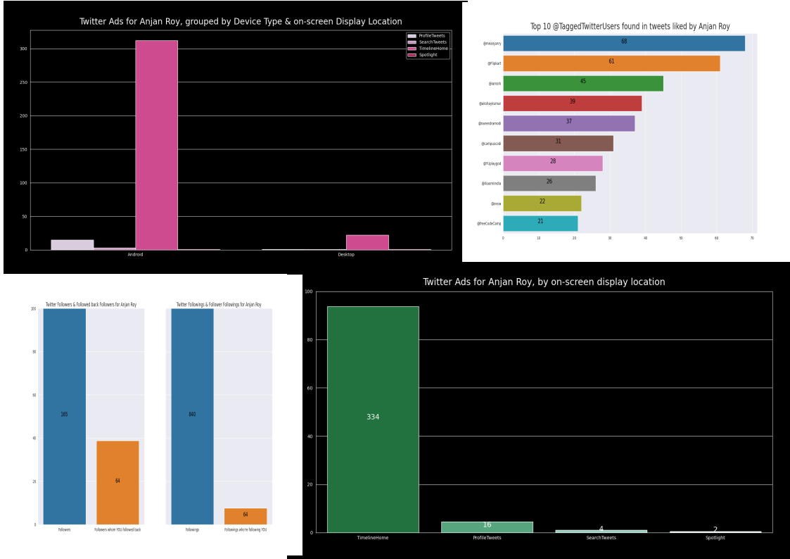

# twiz



Your Twitter Account Data Analysis &amp; Visualization Tool &lt;3

## motivation

Being a data hunter ( yeah, you read it correct ), I love to collect data & analyze it for finding hidden patterns in it.

That's why I downloaded my Twitter account data archive & started analyzing it. This tool can be used for analyzing your twitter account data without sending any of it to remote machines.

I'm adding some features here, if you feel some improvements can be done there, please feel free to contact me or you can always raise a PR.

## data

For obtaining your copy of Twitter account data archive, follow [this](https://help.twitter.com/en/managing-your-account/how-to-download-your-twitter-archive).

## usage

**twiz** can be downloaded from PyPI. Make sure you've python _( >=3.7 )_ installed.

```bash
python3 -m pip install -U twiz
```

If you've added default _pip_ installation path to system **PATH** variable, then it can be invoked as below.

```
twiz path-to-twitter-data.zip sink/
```

## features

- Followers & Followings
    - [x] [Twitter Followers And Followings Per Cent](./docs/twitterFollowersAndFollowingsForYOU.md)
    - [x] [Twitter Followers & Followers whom you're following vs Twitter Followings & Followings who're following you](./docs/twitterFollowersFollowingsAndIntersectionForYOU.md)

- Likes
    - [x] [Top 10 Twitter **#HASHTAGS** found in tweets liked by YOU](./docs/top10TwitterHashTagsFoundInTweetsLikedByYOU.md)
    - [x] [Top 10 **@TaggedTwitterUsers** found in tweets liked by YOU](./docs/top10TaggedTwitterUsersFoundInTweetsLikedByYOU.md)
    - [x] [Top 10 Emojis found in tweets liked by YOU](./docs/top10EmojisFoundInTweetsLikedByYOU.md)

- Advertisement
    - Engagements
        - [x] [Twitter Ads for **YOU**, by target device type](./docs/twitterAdsTargetingYOUOnDevices.md)
        - [x] [Twitter Ads for **YOU**, by on-screen display location](./docs/twitterAdCountByDisplayLocationForYOU.md)
        - [x] [Twitter Ads for **YOU**, grouped by target Device Type & on-screen Ad Display Location](./docs/twitterAdsGroupedByDeviceTypeAndDisplayLocationForYOU.md)
        - [x] [Twitter Ads YOU engaged in, grouped by Advertiser Names](./docs/twitterAdsCountGroupedByAdvertiserNamesForYOU.md)
        - [x] [Top 15 Twitter Ad Engagement Types used in YOUR case](./docs/twitterAdsCountGroupedByEngagementTypesForYOU.md)
        - [x] [Top 15 Twitter Advertisers with respective Engagement Types for YOU](./docs/twitterAdsCountGroupedByAdvertiserNamesAndEngagementTypesForYOU.md)
        - [x] [Twitter Ad targeting criterias used by top X advertisers for YOU](./docs/twitterAdTargetingCriteriasUsedForYOUByTopAdvertisers.md)
        - [x] [Top X Advertisement Target Criterias used for YOU on Twitter](./docs/top20AdTargetCriteriasUsedForYOUOnTwitter.md)
        - [x] [{Locations, Age, Follower look-alikes, Platforms, ...} -used as Twitter Ad Target Criterias](./docs/groupedTwitterAdTargetCriteriasUsedForYOU.md)

**This section will keep getting populated ;)**
