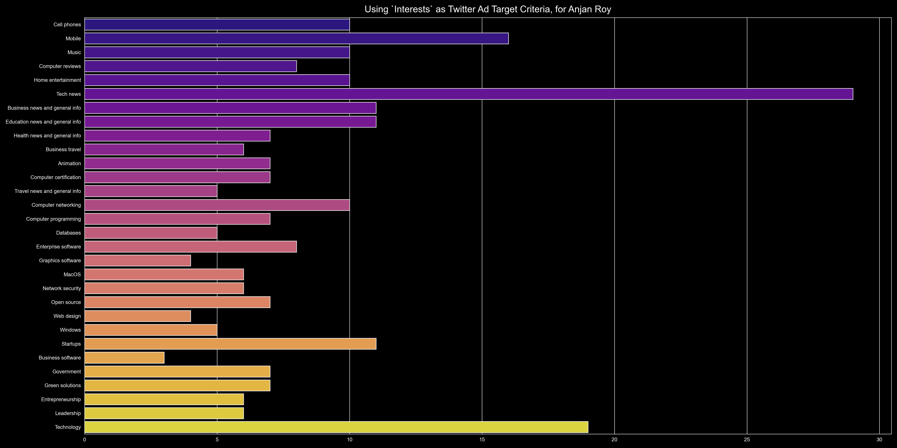
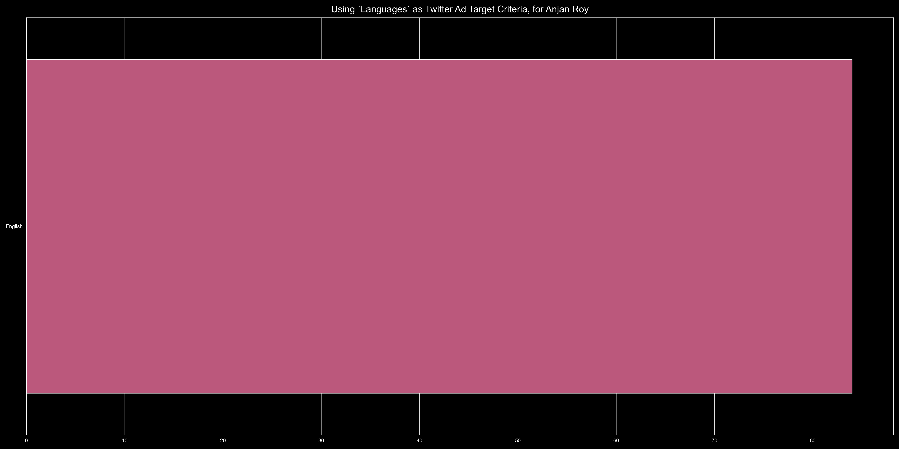
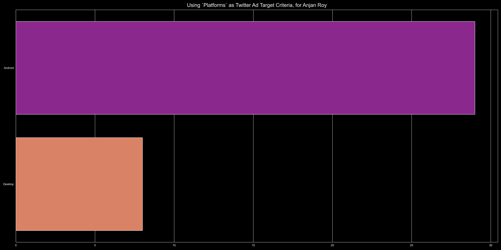
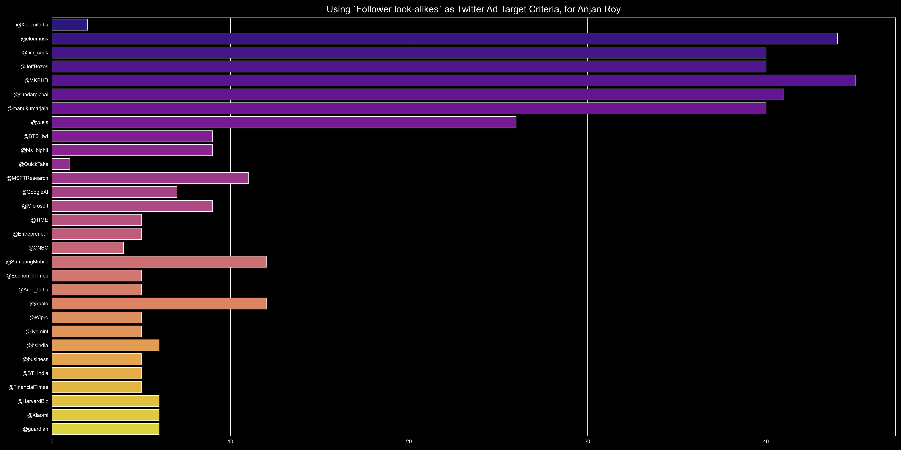

# {Locations, Age, Follower look-alikes, Platforms, ...} -used as Twitter Ad Target Criterias

## intro

Here's we're going to first find out all those possible ad target categories, used for targeting ads. Then for each of them, we'll find out figure out top 30 most used target values used, which are to be plotted as horizontal bar plot.

## example

Here're some example plots from some ad target criterias.

### Locations

### Gender

### Age

### Interests

### Languages

### Platforms

### Follower look-alikes

More can be found [here](../plots)
