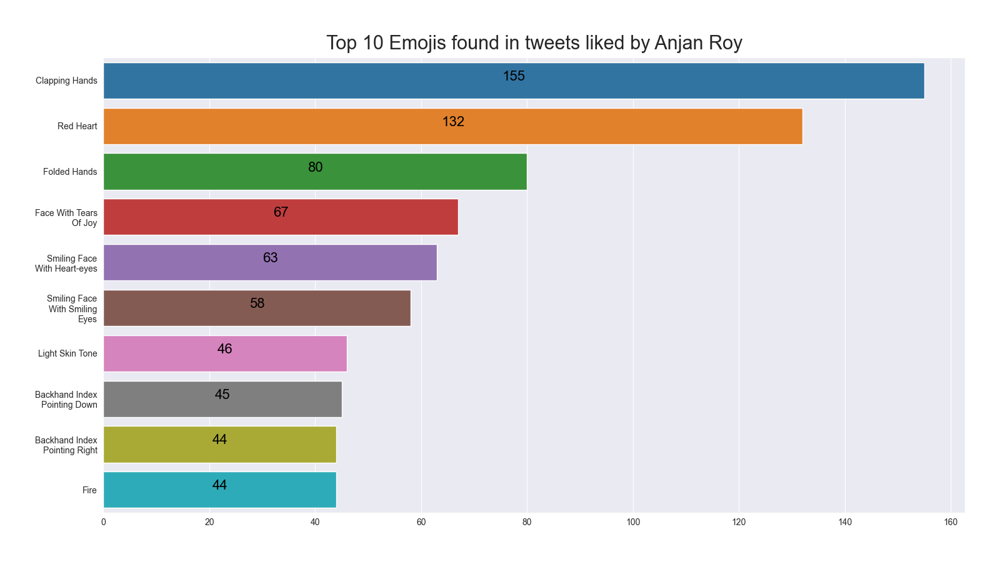

# Top X Emojis found in tweets liked by YOU

## intro

Extracts out all emojis from text content of tweets liked by YOU & then find top X emojis in terms of #-of occurance. 

Note: _Due to issue faced in showing emojis in matplotlib plot, we're just going with textual representation of emojis i.e. demojized version._

## example

Here's an example plot.

