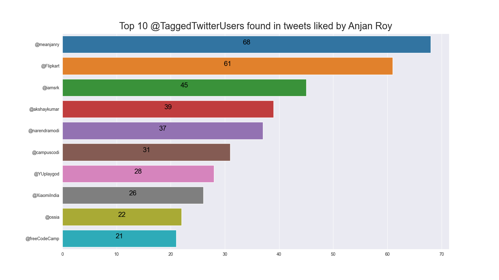

# Top 10 **@TaggedTwitterUsers** found in tweets liked by YOU

## intro

After parsing out all liked tweets of account owner ( i.e. YOU ), we're going to extract out all tagged twitter usernames, found in text content of liked tweets. 

From that set of tagged twitter user names, we'll pick top 10 user names, in terms of their appearance count.

## example

Here's a sample plot.

