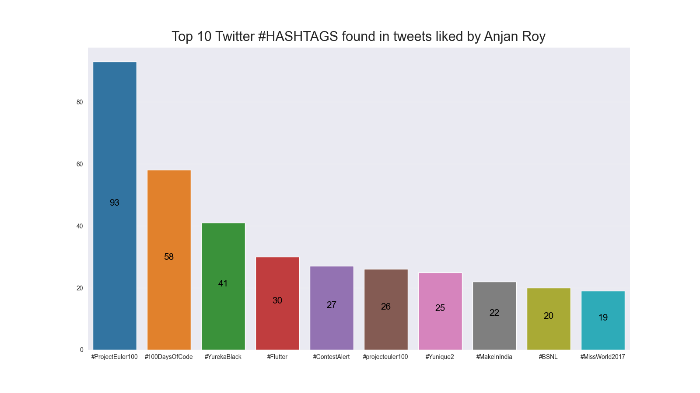

# Top 10 Twitter **#HASHTAGS** found in tweets liked by YOU

## intro

Here we're going to parse all tweets you liked & then extract out all **#HASHTAGS** present in them. Then we'll plot top 10 most used hashtags as a bar plot, along with their respective count.

## example

Here's a sample plot.

