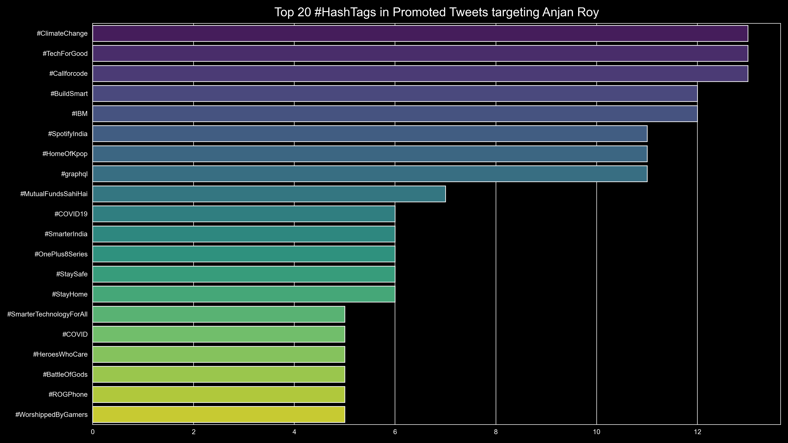

# Top 20 Twitter **#HashTags** found in Promoted Tweets for YOU

## intro

In this case, we're first going to find out all those tweets which were promoted, targeting YOU. Then from each of those tweets we'll find out all **#HashTags**. And now we've a stat on which hash tag was used how many times.

So we're going to be plotting top 20 **#HashTags** as a bar plot.

## example

Below is an example plot.

