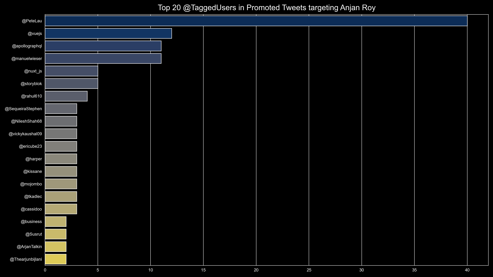

# Top X @taggedUsers in promoted tweets targeting YOU

## Introduction

For this study, we're going to parse out all @taggedUsers in promoted tweets targeting you, from twitter account data dump. Then we're going to pick up top X _( in terms of number of occurance )_ of them, which are to be plotted as horizontal bar chart.

## Example

👇 is a demonstration, with my account data

