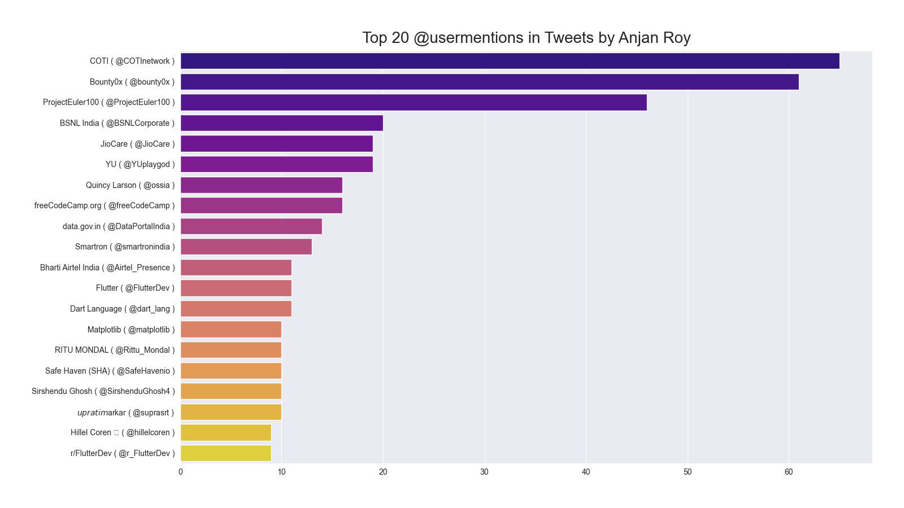

# Top 20 @UserMentions in tweets by YOU

## Introduction

We're picking up top X **@usermentions** by this user & plotting them as barchart.

## Example

Below is a demostrative plot for this category.

