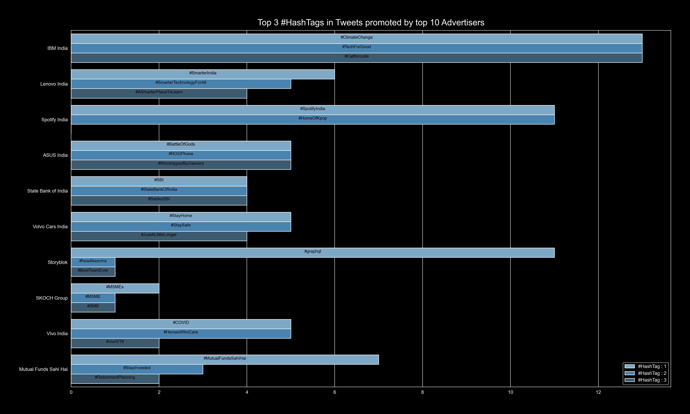

# Top 3 **#HashTags** in tweets promoted by top 10 advertisers, targeting YOU

## intro

Here we're going to first figure which advertisers are using which **#HashTags** how many times in their promoted tweets. Then top 3 **#HashTags** they used, to be picked up for plotting grouped bar chart, depicting each advertiser's preference of using **#HashTags** in promoted tweets.

## example

I analyzed my data & found this. You can also generate yours by installing `twiz`.

