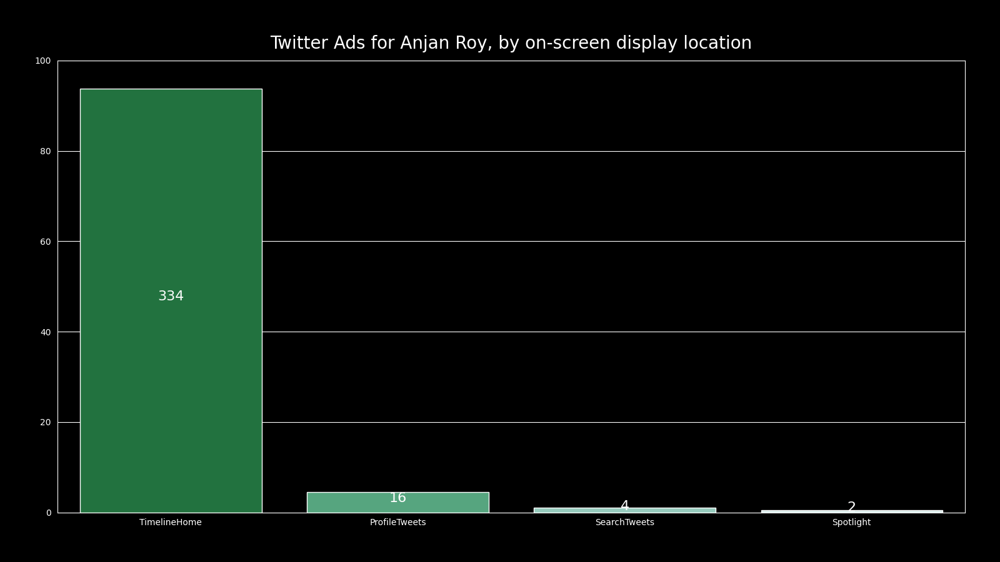

# Twitter Ads for *YOU*, by on-screen display location

## intro

We're going to classify all twitter advertisments, in which you engaged, into classes & shown their respective count as a bar plot.

## example

Here's a sample plot.

