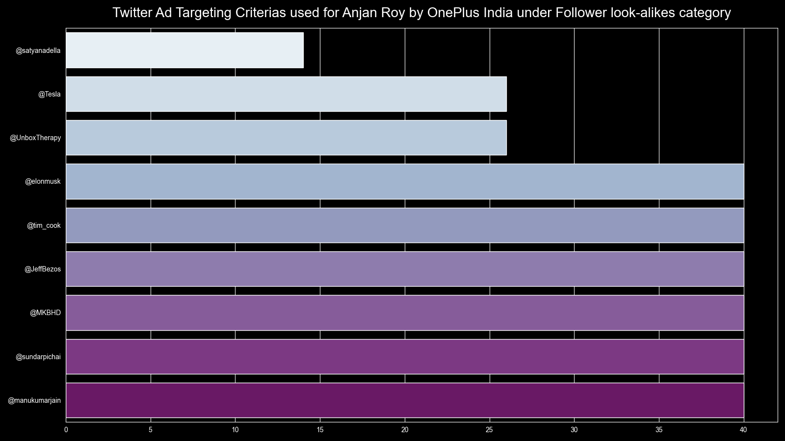
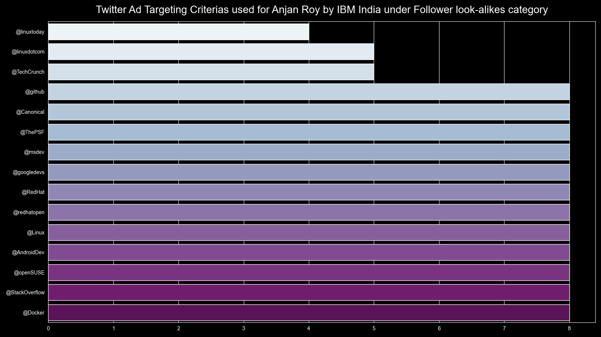
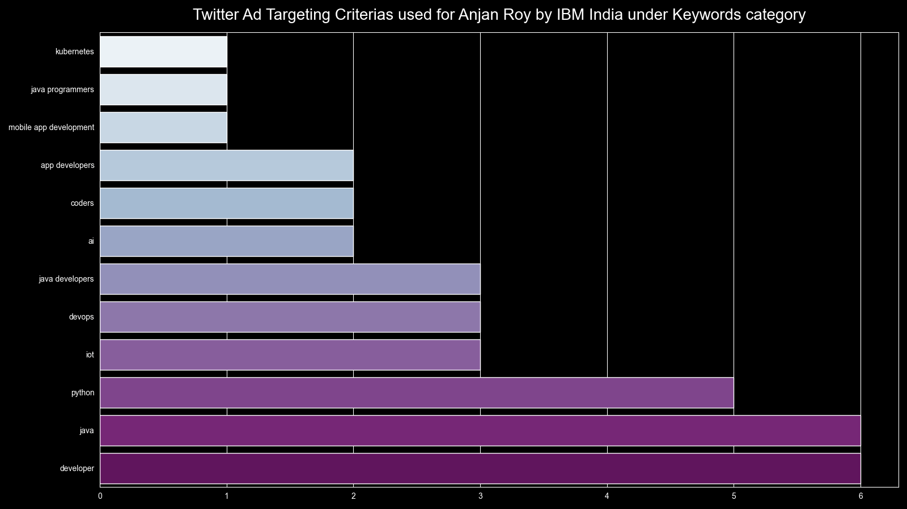

# Twitter Ad targeting criterias used by top X advertisers for YOU

## intro

Here we're going to first pick up top X twitter advertisers, in terms of number of advertisements you engaged in. Then for each of those top advertisers, we're going to pick up their respective ad targeting criterias _( used for targeting YOU )_ & plot their values used with count as bar plot. 

## example

I'm going to show how two top advertisers used various targeting criterias below.

### OnePlus India

Lets see how they're using **Follower look-alikes** param.

### IBM India

Let's see how they're using {**Follower look-alikes**, **Keywords**} param for targeting twitter users.

Follower look-alikes | Keywords
--- | ---
 | 

