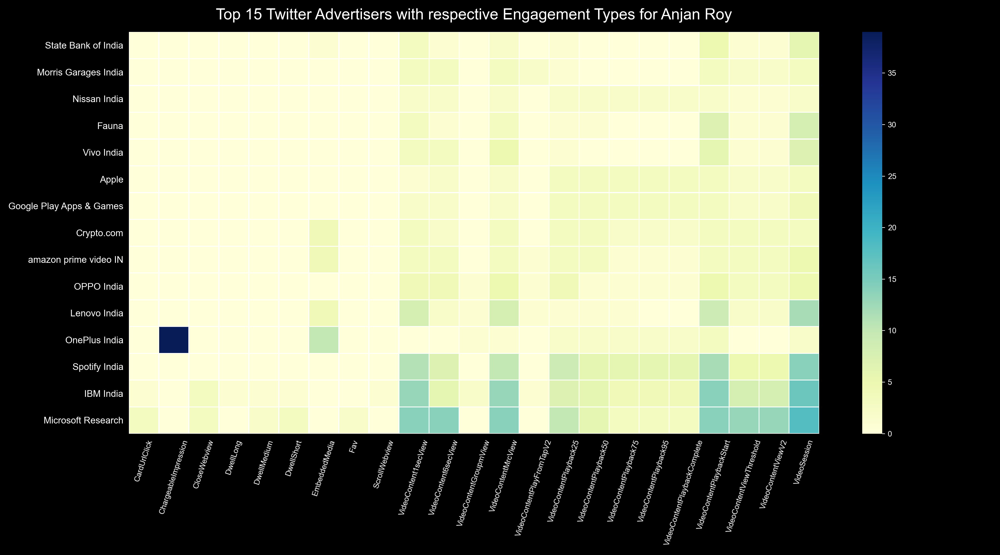

# Top X Twitter Advertisers with respective Engagement Types for YOU

## intro

Here we're going to first find out all advertisers whose ad was shown to you at some point on twitter, then create a counter with used advertisement engagement type for each of them. 

That's what is going to be plotted as a heatmap. Along X axis we'll put engagement types & on another axis we're putting advertiser names. 

We're going to only consider top X advertisers, w.r.t engagement count.

## example

Here's a sample plot.

