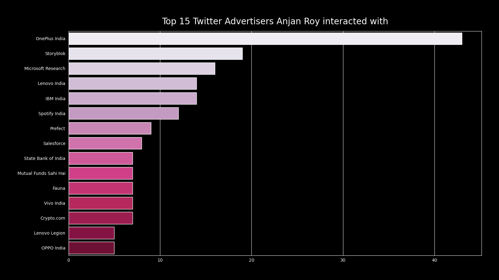

# Twitter Ads YOU engaged in, grouped by Advertiser Names

## intro

In this section we're going to plot a bar chart, depicting how many ads you engaged in from each of advertisers - plotting top X _( = 15 )_ of them.

## example

Here's a demo plot.

