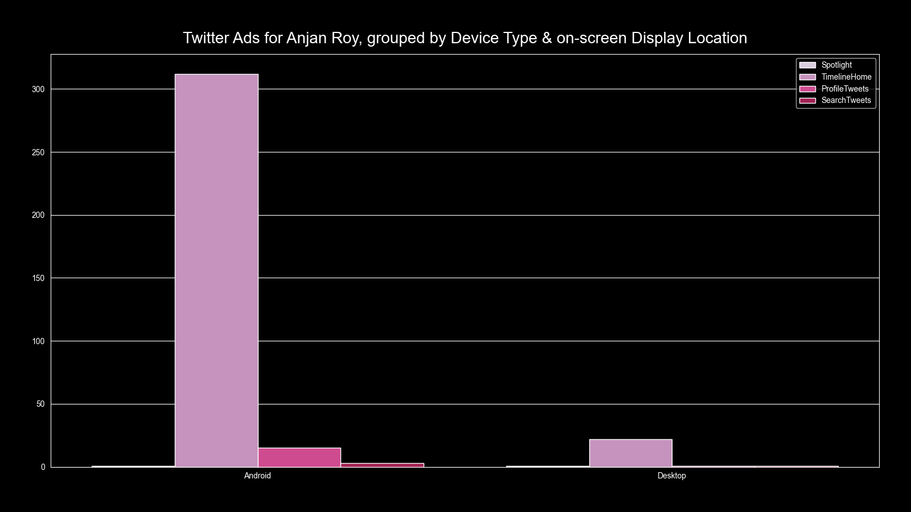

# Twitter Ads for YOU, grouped by target Device Type & on-screen Ad Display Location

## intro

We're going to first group all advertisements, you engaged in, by their target device type i.e. _{Android, iOS, Desktop}_ & then each of the subgroups to be classified by their on-screen Ad Display Location i.e. _{TimelineHome, Spotlight, SearchTweets, ProfileTweets}_. That's to be plotted as grouped bar plot.

## example

Here's a sample plot.

