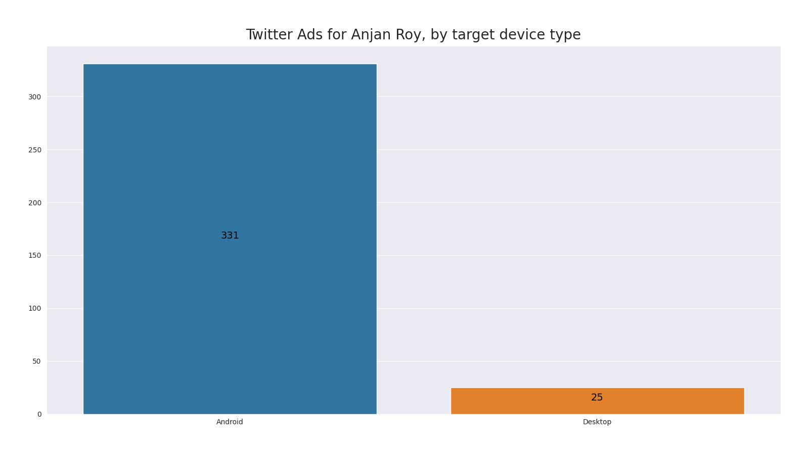

# Twitter Ads for **YOU**, by target device type

## intro

We're going to extract out twitter advertisement engagement data from _Twitter Account Data Archive_ & plot on which device how many advertisement engagements happened.

## example

Here's a sample plot.

