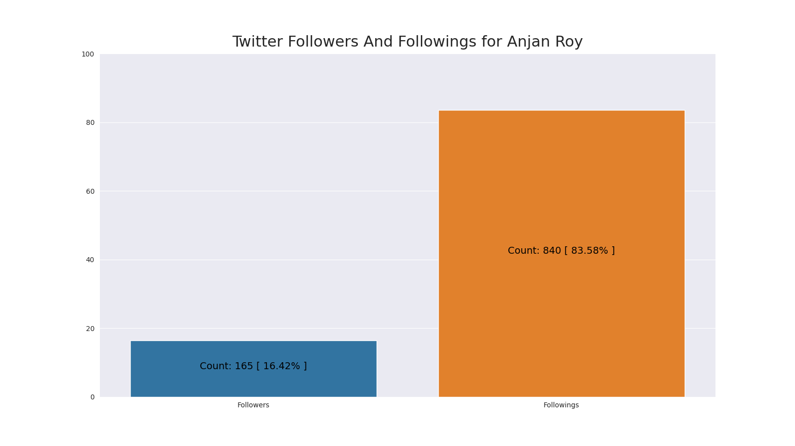

# Twitter Followers And Followings Per Cent

## intro

So we all have certain number of followers & followings on twitter. 

Lets assume I've `x` followers & `y` followings on Twitter. Now for most of the accounts difference between these two counts can be very large, which is why we're going to scale these numbers into range of (0 - 100).

- Followers : (x / (x + y)) * 100
- Followings : (y / (x + y)) * 100

Then we plot these two counts as bar chart.

## example

Here's a sample plot.

