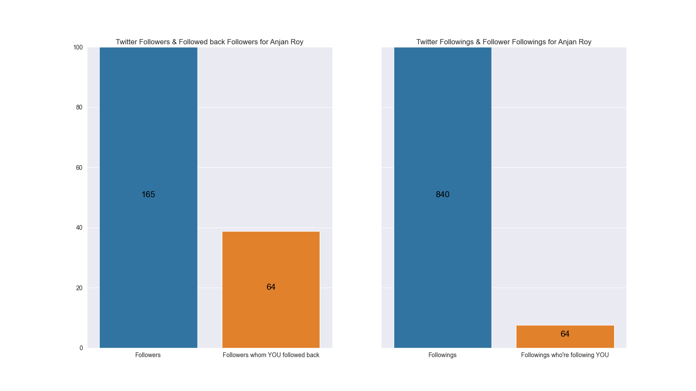

# Twitter Account Followers, Followings & intersection of them

## intro

In this section, we're going to plot two bar charts comparing 

- Twitter Followers & Followers whom you followed back
- Twitter Followings & Followings who're following you

For that we'll need to compute set intersection of followers & followings for your account.

## example

Here's a sample plot.

